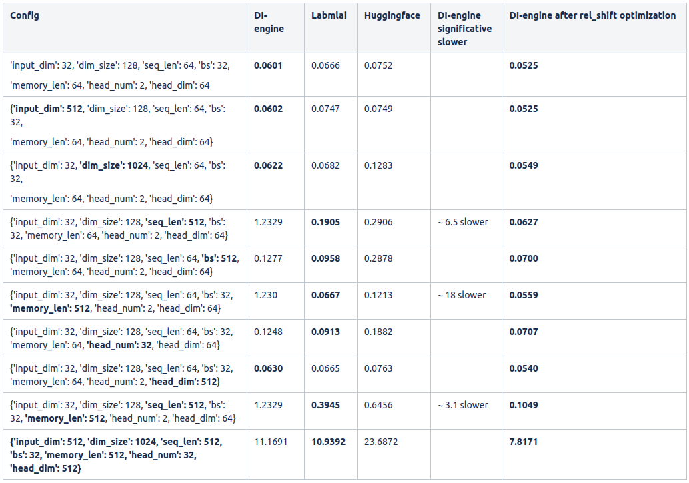

# Transformer Attention Benchmark
 
The goal of this repository is to benchmark the speed of different attention-XL implementations. Current implementations include:
- [DI-engine](https://github.com/opendilab/DI-engine/blob/main/ding/torch_utils/network/gtrxl.py)
- [Huggingface](https://github.com/huggingface/transformers/blob/main/src/transformers/models/transfo_xl/modeling_transfo_xl.py)
- [Labmlai](https://github.com/labmlai/annotated_deep_learning_paper_implementations/blob/e75e53bb03bc3ab68ce61699c0fcf280d4cfb3d6/labml_nn/transformers/xl/__init__.py#L47)
- [Sooftware](https://github.com/sooftware/attentions/blob/master/attentions.py)

## Benchmark results

<p align="center">
    
</p>

## Run

Clone this repository
```
git clone https://github.com/davide97l/attention-benchmark
cd attention-benchmark
```
Install DI-engine
```
git clone https://github.com/opendilab/DI-engine
cd DI-engine
pip install -e .
```
Install Huggingface
```
git clone https://github.com/huggingface/transformers
cd transformers
pip install -e .
```
Install Labmlai
```
git clone https://github.com/labmlai/annotated_deep_learning_paper_implementations
cd annotated_deep_learning_paper_implementations
pip install -e .
```
Other implementations don't have any intra-framework dependency, thus it is not necessary to install their framework,
but the single runnable file is immediately available.
